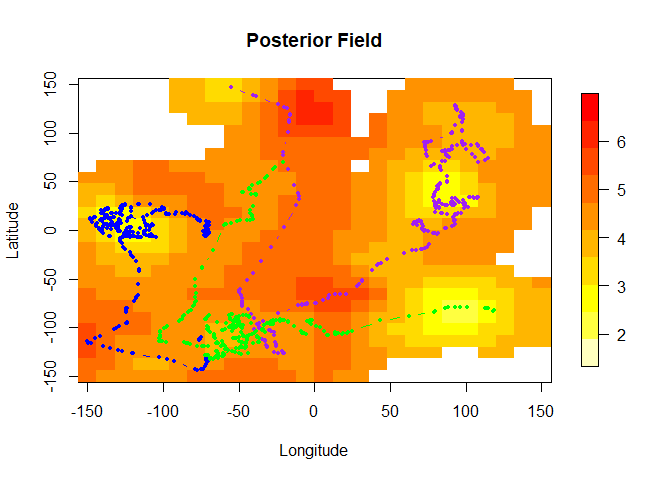
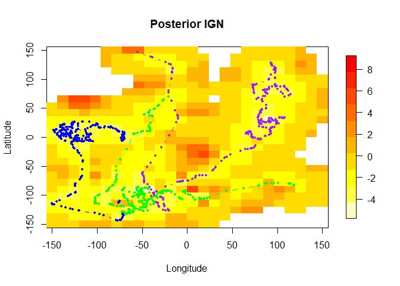

Preferential Sampling with moving monitoring stations
================

This repository is a companion resource to the paper "Modelling ocean temperatures from bio-probes under preferential sampling" (submitted), by Daniel Dinsdale and Matias Salibian-Barrera and it contains code to illustrate how to apply the methods discussed in that paper.

Introduction
------------

Below we illustrate how to model data obtained from sensor tags mounted on marine mammals which may have been preferentially sampled. The `R` code used below in this document can also be found in a single file here: [runfile.R](runfile.R). The required functions are in the file [dataFncs.R](dataFncs.R), and the negative log-likelihood function required by [TMB](https://cran.r-project.org/package=TMB) is in the file [TMBfile.cpp](TMBfile.cpp).

The example below follows the simulation settings discussed in Section 4 of the paper and uses the Preferential-CRW model to generate preferentially sampled animal tracks and their corresponding temperature observations. We then compare parameter estimation and prediction using standard methods and the preferential model in TMB.

##### Warning

Note that running this code may require a large amount of RAM (we recommend 16GB).

Generating a data set
---------------------

First we source the file [dataFncs.R](dataFncs.R) which contains the necessary functions to generate the data.

``` r
source('dataFncs.R')
```

Now we specify the parameters to generate the data set. These can be altered to vary the properties of the latent field to be sampled and also to change the movement patterns of the sampler. Refer to the paper for more details on the model.

First we set the parameters of the assumed Matern covariance function and the (constant) mean of the underlying random field:

``` r
# constant mean
mean <- 5
# scale (range)
phi <- 25 
# nugget (measurement) variance
nugget <- 0.1
# smoothness (assumed known in estimation)
kappa <- 2
# marginal variance (partial sill)
GPVar  <- 1.5
# define the covariance model
model <- RMwhittle(nu=kappa, var=GPVar, scale=phi)
# finally trend = 0 just means our mean trend is constant (mean from above)
trend <- 0
```

Next we specify the parameters that determine the movement/sampler properties. Please refer to the paper for more details on the model and its parameters.

``` r
# is starting location random? (0 = yes and >0 multivariate normal with
# mean 0 and diagonal covariance matrix with variance=start)
start <- 0
# alpha[1] defines starting value of beta_1 from eq (3.6)
# alpha[2:3] are currently both equal to \alpha from eq (3.7). They could be changed to
# adopt preferential movement varying in strength across latitude/longitude.
alpha <- c(-1.5, 100, 100)
# the number of tracks in the simulation
numTracks <- 3
# the number of data points to simulate per track
n <- 360
# the number of observations to throw out per track (ie/ total sample
# size per track is n-burnIn)
burnIn <- 60
# the rate parameter of the exponential distribution used to generate the sampling times
timing <-  10
# measurement location noise (currently not included in models)
noise <- 0
# movement parameters
# behaviour (beta) standard deviation parameter (\sigma_{\beta} in eq (3.6))
behavSD <- .1 
# movement standard deviation parameter (diag(\Sigma) in eq (3.3))
moveSD <- 3 
# combine standard deviations for later use
dataParam <- c(behavSD, moveSD)
```

We now create a spatial grid (lattice) for data simulation and also for model fitting/predictions. These can be the same if `nrowcol = l` (the latter is a lowercase letter `L`) but we can choose different grid sizes for computational efficiency.

``` r
# define the domain to simulate data
# how man rows/columns
nrowcol <- 51
x <- seq(-150, 150, length.out=nrowcol)
y <- seq(-150, 150, length.out=nrowcol)
# simulation grid
gridFull <- expand.grid(x,y)

# l is the number of grid cells in each direction across our
# grid going from -150 to 150 degrees lat and lon for our model fitting
# and prediction.
l <- 26
xseq <- (seq(-150, 150, length.out=l))
yseq <- (seq(-150, 150, length.out=l))
# create the prediction lattice
lattice <- expand.grid(xseq,yseq)
colnames(lattice) <- c("Y1New", "Y2New")
```

<!-- ```{r initiate, include=FALSE} -->
<!-- # initiate objects -->
<!-- # nonPrefParams <- NULL -->
<!-- # prefParams <- NULL -->
<!-- # postBias <- NULL -->
<!-- # krigBias <- NULL -->
<!-- # nonPrefBias <- NULL -->
<!-- # postIGN <-  NULL -->
<!-- # krigIGN <- NULL -->
<!-- # nonPrefIGN <- NULL -->
<!-- # nonPrefParams <- array(NA, dim=c(1, 4)) -->
<!-- # prefParams <- array(NA, dim=c(1, 8)) -->
<!-- ``` -->
Now we are ready to generate the data. We first simulate the latent field and then run the sampler using the function `genPrefDataHybridBehav` which can be found in `dataFncs.R`. From here we will extract the data and the so-called true surface on the lattice and observed locations.

``` r
# simulate the random field
set.seed(6351)
rawDat <- RFsimulate(model, x=as.matrix(gridFull),  exactness=TRUE)
# simulate the observations and sampling locations
Xsim <- genPrefDataHybridBehav(n=n, movementParam=dataParam, nrowcol=nrowcol, m=0, 
                               paramGP=c(mean, phi, nugget, kappa, GPVar), numTracks=numTracks, 
                               alpha=alpha, rawDat=rawDat, start=start, burnIn = burnIn, timing=timing)
# extract sampling data
data <- Xsim$Dat
# extract true surface data
surface <- Xsim$surface
colnames(data) <- c("Time", "Lon", "Lat", "Temp", "gradientX", "gradientY", "Beta", "Track")
# here is how the data (locations and respective latent field measurements)
head(data)
```

    ##         Time      Lon      Lat     Temp  gradientX   gradientY      Beta
    ## 1 0.00000000 90.62477 83.41096 4.222824 0.01650040 -0.02259048 -1.217568
    ## 2 0.03895239 90.22061 82.80155 4.167551 0.01499146 -0.02558380 -1.255394
    ## 3 0.08395329 89.59377 82.23768 4.119081 0.01388511 -0.02918536 -1.267580
    ## 4 0.11661354 88.57083 82.05452 3.890522 0.01444768 -0.03325392 -1.257057
    ## 5 0.29282906 84.62312 80.91155 3.690016 0.01259540 -0.04931482 -1.254136
    ## 6 0.32905096 85.08989 80.72604 3.703261 0.01180773 -0.04797840 -1.273623
    ##   Track
    ## 1     1
    ## 2     1
    ## 3     1
    ## 4     1
    ## 5     1
    ## 6     1

``` r
# now we thin the data to 300 locations in total for analysis 
selection <- seq(1, nrow(data), length.out = 300)
dataThin <- data[selection, ]
```

Here is how the data looks. Each colour is a different track and dots are sampling locations which are superimposed onto the unknown latent field. Note, that this is the same data from Fig 2.


Now we compile the file [TMBfile.cpp](TMBfile.cpp) to use in TMB. This file contains the negative joint log-likelihood function −log(\[*X*, *Y*, *S*\]). Note that you must have installed the [TMB](https://cran.r-project.org/package=TMB) `R` package from CRAN.

``` r
compile("TMBfile.cpp")
dyn.load(dynlib("TMBfile"))
```

Next is some house keeping to prepare the data for TMB (refer to the comments inside the script below for details):

``` r
# replace data with thinned version
data=dataThin
# obtain sampling times
tsim <- data[,1]
# number of observations in total
numObs <- nrow(data)
# Generate random measurements
# create trackID which records when new tracks start in the dataframe
trackLength <- NULL
trackId <- 0
for(i in 1:numTracks){
  trackLength <- c(trackLength, length(which(data$Track==i)))
  trackId <- c(trackId, sum(trackLength))
}
# create a set of locations which allows for gradients to be calculated in cpp file
Yobs <- data$Temp
Y1New <- data[,2]
Y2New <- data[,3]
for(i in 1:length(data[,1])){
  Y1New <- c(Y1New,data[i,2]+.5, data[i,2])
  Y2New <- c(Y2New,data[i,3], data[i,3]+.5)
}
# combine prediction lattice with sampling locations and gradient locations
predGrid <-  rbind(cbind(Y1New, Y2New), lattice)
```

Next we create a mesh using `inla.mesh.create` to use the SPDE approach of `R-INLA`. We mush be careful to specify an index that matches sampling locations with mesh locations, but also change indexing for use in the `C++` code.

``` r
# create INLA mesh
mesh <- inla.mesh.create(loc = predGrid, extend = T, refine = T)
# now create an index that matches sampling locations with mesh locations
ii0 <- mesh$idx$loc
# Create data for TMB
dataTMB <- list(tsim=tsim,Y1=Y1New, Y2=Y2New, Y=Yobs, trackId=trackId,  meshidxloc=mesh$idx$loc-1)
```

Now we will create our sparse precision matrix for smoothness (*κ*) 2, which enables the field to be differentiable (in mean square sense). For details on this part see Appendix A.

``` r
# using SPDE method from R-INLA with alpha=2 (kappa=1)
dataTMB$spde <- (inla.spde2.matern(mesh, alpha=2)$param.inla)[c("M0","M1","M2")]
# create our own sparse precision matrix for alpha=3 (kappa=2)
M0 <- (inla.spde2.matern(mesh, alpha=2)$param.inla)["M0"]$M0
M1 <- (inla.spde2.matern(mesh, alpha=2)$param.inla)["M1"]$M1
M2 <- (inla.spde2.matern(mesh, alpha=2)$param.inla)["M2"]$M2
M3 <- M2%*%solve(M0)%*%M1
M3 <- as(M3, "dgTMatrix")
dataTMB$spde[["M3"]]<- M3
# number of rows in SPDE object
n_s = nrow(dataTMB$spde$M0)
# vector of 1's used in TMB (this should be updated)
dataTMB$Ind <- rep(1, n_s)
# create geodata object
obj1 <- cbind(cbind(dataTMB$Y1, dataTMB$Y2)[1:length(dataTMB$Y),], dataTMB$Y)
geodata <- as.geodata(obj1, coords.col = 1:2, data.col = 3)
```

Parameter Estimation
--------------------

Time to fit some models! First let us fit a standard model using `likfit` from the pacakge `geoR`. This approach ignores any preferential effect and works conditional on the observed sampling locations **X**.

``` r
standardMLE <- likfit(geodata, coords = geodata$coords, data = geodata$data, kappa=kappa, ini=c(.5,.5))
```

    ## ---------------------------------------------------------------
    ## likfit: likelihood maximisation using the function optim.
    ## likfit: Use control() to pass additional
    ##          arguments for the maximisation function.
    ##         For further details see documentation for optim.
    ## likfit: It is highly advisable to run this function several
    ##         times with different initial values for the parameters.
    ## likfit: WARNING: This step can be time demanding!
    ## ---------------------------------------------------------------
    ## likfit: end of numerical maximisation.

``` r
(standardMLE)
```

    ## likfit: estimated model parameters:
    ##      beta     tausq   sigmasq       phi 
    ## " 4.3058" " 0.1093" " 0.7261" "18.5567" 
    ## Practical Range with cor=0.05 for asymptotic range: 99.6194
    ## 
    ## likfit: maximised log-likelihood = -170.3

Next we will fit the model in `TMB`. First we define the parameters for the model (including latent states). Our latent states are the field **S** and behavioural states **beta**. The call to `MakeADFun` creates the likelihood function, which is then optimized numerically using `nlminb` (but other general-purpose optimization functions, e.g. `optim`, can also be considered).

``` r
parameters <- list(
  S = rep(0, n_s),
  beta = rep(0, length(dataTMB$Y)),
  mu = standardMLE$beta,
  log_papertau = 3,
  log_kappa = log(1/standardMLE$phi),
  alpha = rnorm(1,alpha[2], 0.25),
  log_d = log(dataParam[2]),
  log_sdbehav = log(dataParam[1])
)
# create TMB object (note= random=c("S", "beta") to
# integrate out random field and latent behvaiour states)
obj <- MakeADFun(dataTMB, parameters, random=c("S", "beta"), DLL="TMBfile", method = "nlminb", hessian=FALSE, silent=T)
# conduct maximisation
opt <- try( nlminb(obj$par,obj$fn,obj$gr, control=list(rel.tol=1e-7)) )
# rerun up to 4 times in case of any gradient errors
for(m in 1:4){
  if(class(opt) != 'try-error' && opt$convergence == 0) {
    print("Success!")
  }
  else{ 
    paste0("Failed, try number ", m)
    lengthPar <- length(obj$env$last.par.best)
    tmp <- obj$env$last.par.best[(lengthPar-5):lengthPar] + 0.01
    opt <- try(nlminb(tmp,obj$fn,obj$gr, control=list(rel.tol=1e-7)))
  }
}
```

    ## [1] "Success!"
    ## [1] "Success!"
    ## [1] "Success!"
    ## [1] "Success!"

``` r
# Extract sigma^2 (partial sill)
report_spde <- obj$report()
```

It is always good practice to verify that the optimization iterations have converged:

``` r
# check convergence
opt$convergence
```

    ## [1] 0

``` r
# Obtain the standard errors
sdre <- try( sdreport(obj) )
if( class(sdre) != 'try-error') {
  # input params
  summary(sdre, "fixed")
}
```

    ##                Estimate  Std. Error
    ## mu             4.406319  0.24327250
    ## log_papertau   4.215612  0.21093490
    ## log_kappa     -2.830299  0.15373855
    ## alpha        142.870640 25.55025060
    ## log_d          2.209733  0.03291732
    ## log_sdbehav   -2.733629  1.25336438

Prediction
----------

We have obtained parameter estimates for the standard method and for the preferential model using `TMB`. To predict using the non-preferential model we will use kriging with plug-in parameters obtained from the standard `likfit` function. For the preferential model we use the mode of the **\[S|Y,X\]** at the optimal parameters. This is provided by `TMB` as part of the Laplace approximation procedure and is defined in eq (2.7) of the paper.

``` r
# conduct simple kriging using standard MLE plug-in parameters
SKDat <- krige.control(obj.model = standardMLE, type.krige = "SK")
# now predict at the prediction "lattice" locations where signal=T is used
# to specify that there was measurement error on our data observations
nonPredPref <- krige.conv(geodata, loc = lattice, krige = SKDat, output=list(signal=T))
```

    ## krige.conv: model with constant mean
    ## krige.conv: Kriging performed using global neighbourhood

``` r
# finally we obtain preferential model field prediction from mode of [S|Y,X]
modePred <- obj$env$last.par.best[(length(Y1New)+1):(length(Y1New)+nrow(lattice))]
# non-pref predictions
nonPrefPred <- nonPredPref$predict
# non-pref prediction variance
nonPrefVar <- nonPredPref$krige.var
# prediction variance from TMB
predVar <- (summary(sdre, "random")[(length(Y1New)+1):(length(Y1New)+nrow(lattice)),2])^2
```

Next we want to be able to compare these predictions to the real values of the field at the prediction points.

``` r
# obtain real data on prediction lattice
# match indicies of full grid used to simulate data and prediction lattice
matchedIndic <- row.match(lattice,gridFull)
rawDatSmall <- rawDat$variable1[matchedIndic] + mean
```

Now let us calculate the mean ignorance score for each method on this data set (MIGN from eq (4.2) in the paper). Recall that the ignorance function (IGN) is given by

``` r
IGN <- function(pred, act, var) {
  ((pred - act)^2) / var + log(var)
}
```

Then the MIGN can be computed as follows:

``` r
IgnScorePost <- IGN(modePred, rawDatSmall, predVar)
IgnScoreNonPref <- IGN(nonPredPref$predict, rawDatSmall, nonPredPref$krige.var)
mean(IgnScorePost)
```

    ## [1] -0.5294663

``` r
mean(IgnScoreNonPref)
```

    ## [1] -0.3737076

Finally we can plot the IGN scores and compare predictive surfaces from the non-preferential and preferential models. We consider only prediction locations in regions near the sampling locations: 

Note that the mean IGN for the following two plots are -0.96 (TMB) and -0.88 (kriging) respectively. Comparing this to Fig 5 (b), this simulation shows a relatively small improvement by the preferential model compared to most simulations with these parameters, mainly due to the large coverage of the field by the data locations. 
